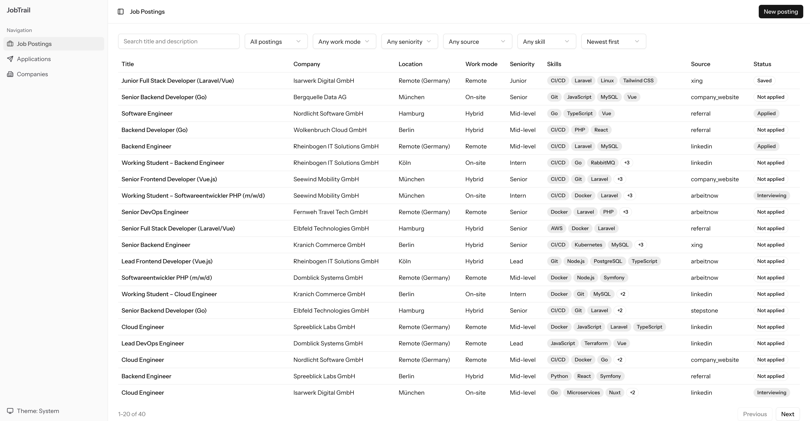
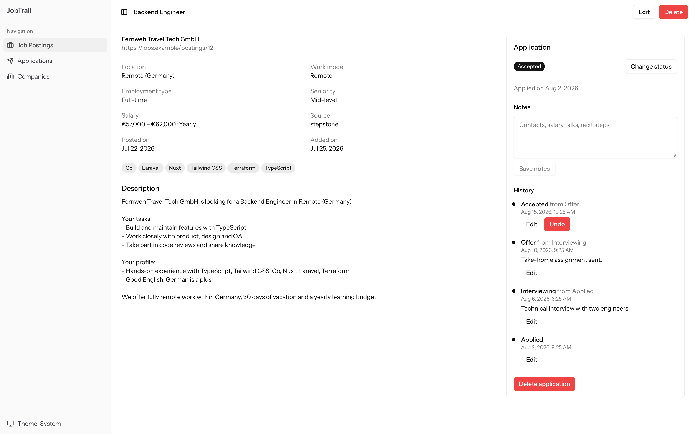
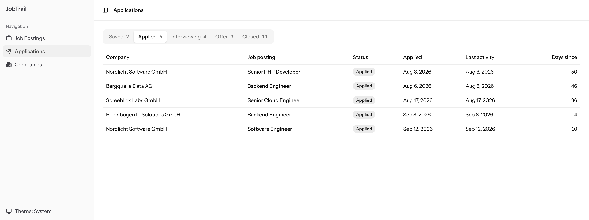
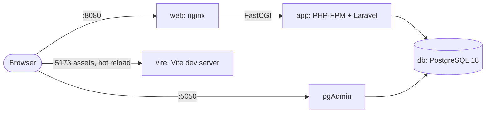

# JobTrail

[](https://github.com/zoranstankovic/jobtrail/actions/workflows/ci.yml)

JobTrail is a personal job search tracker that runs on your machine. It keeps the job postings you find and the companies behind them, shows at a glance which postings you applied to, and records every status change of an application as a timeline.

It is a single-user app without a login, built with Laravel 13, Vue 3 and PostgreSQL 18. One command starts everything, demo data included.



## Features

- **Job postings** with company, location, work mode, seniority, salary, source, skills and the full text of the ad.
- **Search and filters:** full-text search over title and description; filters for application state, work mode, seniority, skill and source.
- **Companies** as their own records, created inline while adding a posting.
- **Applications** with seven statuses (Saved, Applied, Interviewing, Offer, Accepted, Rejected, Withdrawn) and a dated history. Entries can be backdated, edited and undone, and the history always stays in order.
- **Follow-ups first:** the Applications view groups applications by status and lists the ones with the oldest activity first.
- **Light and dark theme:** a toggle in the sidebar; by default it follows the operating system.
- **Demo data:** 12 fictional companies, 40 postings and 25 applications from the German job market, recreated identically on every reset.





## Quick start

You need Docker with Compose v2 (for example Docker Desktop) and free ports 8080, 5173, 5432 and 5050. JobTrail is developed on macOS with Docker Desktop and also checked on Linux with Docker Engine.

```bash
git clone https://github.com/zoranstankovic/jobtrail.git
cd jobtrail
docker compose up
```

The first start builds the image and installs the Composer and npm dependencies, which takes a few minutes. When the log shows `[entrypoint] ready` and the Vite dev server has started, open <http://localhost:8080>.

There is nothing else to set up: `.env` is created from `.env.example` with a new application key, the migrations run, and the demo data is seeded into the empty database.

On Linux the containers act as the owner of the checkout, so `vendor/`, `node_modules/`, `.env` and the logs belong to you, not to root.

## Services

| Address                 | Service                                                             |
| ----------------------- | ------------------------------------------------------------------- |
| <http://localhost:8080> | JobTrail (nginx in front of PHP-FPM)                                |
| <http://localhost:5050> | pgAdmin, signed in as `admin@jobtrail.local` / `secret`             |
| `localhost:5432`        | PostgreSQL: database `jobtrail`, user `jobtrail`, password `secret` |
| <http://localhost:5173> | Vite dev server (serves the frontend with hot reload)               |

pgAdmin already lists the server "JobTrail (db)"; the first time you open it, it asks for the database password (`secret`) and offers to save it. These credentials are for local development only.

## Everyday commands

Run `make` to list them. They run inside the containers, so PHP, Composer and Node are not needed on the host.

| Command                         | What it does                                                             |
| ------------------------------- | ------------------------------------------------------------------------ |
| `make up`                       | Start the stack in the background                                        |
| `make down`                     | Stop the stack; data is kept                                             |
| `make logs`                     | Follow the logs of every service                                         |
| `make shell`                    | Open a shell in the `app` container                                      |
| `make test`                     | Code style (Pint), static analysis (Larastan) and the tests              |
| `make lint`                     | Every static check, PHP and frontend, without changing files             |
| `make fresh`                    | Reset the database to the demo data (deletes your data)                  |
| `make artisan cmd="route:list"` | Run an Artisan command; `make composer` and `make npm` work the same way |

## Your data

The database lives in a Docker volume, so it survives restarts. Nothing destructive ever runs automatically.

| Action                                               | Result                                                       |
| ---------------------------------------------------- | ------------------------------------------------------------ |
| `docker compose stop`, Ctrl+C, `docker compose down` | Data is kept                                                 |
| `docker compose up` again                            | Same data; only new migrations run, nothing is reseeded      |
| `make fresh`                                         | Explicit reset to the demo data                              |
| `docker compose down -v`                             | Deletes the volume; the next start seeds the demo data again |

## Troubleshooting

- **A port is already in use:** stop the program that uses it (often a local PostgreSQL on 5432), or change the host side of that port in `compose.yaml`, e.g. `"5433:5432"`.
- **Start from a clean state:** `docker compose down -v`, then `docker compose up`.

## Tech stack

| Layer    | Choice                                                                                     |
| -------- | ------------------------------------------------------------------------------------------ |
| Backend  | Laravel 13 on PHP 8.4                                                                      |
| Frontend | Inertia 3, Vue 3 (Composition API, TypeScript), Tailwind CSS 4, shadcn-vue, Vite 8 + Vite+ |
| Database | PostgreSQL 18                                                                              |
| Tests    | Pest 5, against a real PostgreSQL database                                                 |
| Quality  | Pint, Larastan (level 7), vue-tsc, Vite+ lint and format                                   |
| Infra    | Docker Compose, Makefile, GitHub Actions                                                   |

## How it works



- **Startup:** the `app` container's entrypoint installs dependencies when they are missing, creates `.env`, runs the pending migrations and seeds the demo data only into an empty database. Its health check passes only after that, and `web` and `vite` wait for it.
- **Inertia instead of an API:** Laravel controllers return Vue pages with their data as props, so routing, validation and redirects stay on the server while the UI is a Vue single-page app.
- **Business rules live in Actions** (`app/Actions`): controllers are thin, FormRequests validate input, and every multi-row change runs in one database transaction. The main rule: an application's status always equals the latest entry in its history, and every Action keeps it that way.
- **PostgreSQL does real work:** status and other enum columns have `CHECK` constraints generated from the PHP enums, company and skill names are unique case-insensitively, a posting URL is unique only when present, and full-text search uses a stored generated `tsvector` column with a GIN index.

The full design, including the data model and business rules, is in [docs/design.md](docs/design.md).

## Tests and CI

The Pest suite runs against its own PostgreSQL database (`jobtrail_testing`), never SQLite, because the schema relies on PostgreSQL features. It covers the Actions and their rules, every HTTP endpoint and filter, the database constraints and the demo seeder.

GitHub Actions runs on every push and pull request: it builds the frontend, checks code style, static analysis and TypeScript types, and runs the tests against a `postgres:18` service container.

## Roadmap

| Phase | Content                                                                                                   |
| ----- | --------------------------------------------------------------------------------------------------------- |
| 1     | Postings, companies, skills, applications with history, Docker, tests, CI, demo data (this version)       |
| 1.5   | Analytics dashboard: applications over time, response rates, time to response, most requested skills      |
| 2     | Job-source connectors (APIs and RSS only, no scraping; German market first), enabled per source in config |
| later | Contacts, kanban view, browser tests                                                                      |

## License

[MIT](LICENSE)
